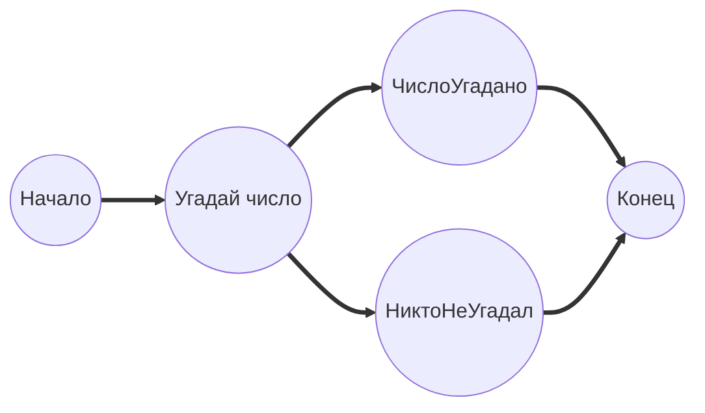
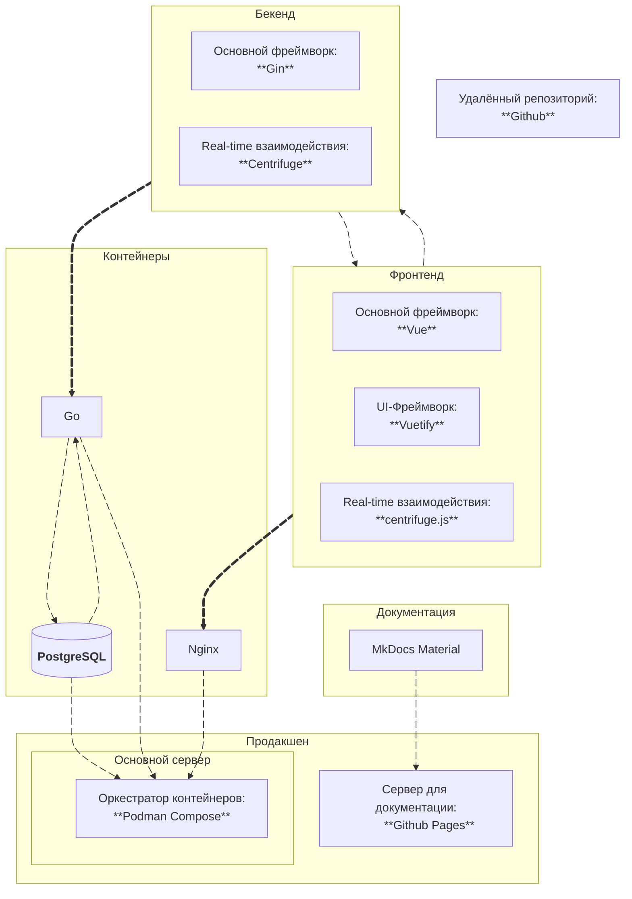

## ==Основы==
Ключевая задача, которую стремиться решить этот проект, звучит так:
    
!!!quote "Главная задача WebPartyTime"
    Как создать модульную и в то же время простую архитектуру для онлайн-представлений, чтобы кто угодно мог легко подстроить проект под себя?

Для её решения проектом предлагается концепт ==PartyFlow== - идея представить каждое сетевое взаимодействие в виде узла общего графа:



Каждый узел такого графа в рамках проекта называется ==PartyQuery==. Каждый ==PartyQuery== содержит информацию об интерфейсе ведущего и участнииков, передаваемой серверу информации и условиях перехода к другим узлам.


> В итоге требуемая гибкость системы достигается за счёт абстракции ==PartyQuery== и его содержимого за общими интерфейсами, которыми неявно управляет декларативно описываемый ==PartyFlow==.  

## ==Архитектура==
Примерное устройство всей системы на уровне крупнейших библиотек приведено на ==диаграмме ниже==:

!!! note ""
    Нажмите на любой из блоков диаграммы, чтобы перейти к сайту соответствующего проекта



## ==WebPartySpec==
На базовом уровне разработка для платформы WebPartyTime сводится к описанию ==PartyFlow== по заданной спецификации - ==WebPartySpec==.


В качестве основы для разработки сценариев используется язык разметки [==TOML==](https://toml.io/en/).

Далее ==WebPartySpec== будет разобран на примере простого сценария для игры =="Угадай число"==.

### Формат
Поля на корневом уровне используются для формирования ==карточки сценария==.

```toml title="guessthenum.webpartyspec"
title = "Угадай число"
description = "Пример игрового сценария для платформы WebPartyTime"
players = [1, 5]
```

Каждый вложенный в корень элемент словаря считается за объявление отдельного ==PartyQuery==.

!!!note ""
    Точкой входа графа считается первое объявление ==PartyQuery== в файле.

С помощью ==layout== выбирается ==раскладка== (или =="интерфейс"==) на стороне ведущего. Внутри указываются актуальные для её отображения данные (которые затем передаются в соответствующий модуль):

```toml
[intro.layout.basic] # Неявно указанная точка входа для сценария
title = "Добро пожаловать"
description = "Игра скоро начнётся"
```

Параметр ==to== используется для задания ==условий перехода== от данного узла к узлу, указанному после ==to==:

```toml
[intro.to.guess]    # Переход от intro к guess произойдёт
timer = "00:00:05"  # По истечении таймера.
```

!!!note ""
    Можно устанавливать множество условий для перехода, при этом переход срабатывает при соблюдении ==любого из них==:

    ```toml
    [intro.to.guess]    # Переход от intro к guess произойдёт
    timer = "00:00:05"  # По истечении таймера,
    inputBased = true   # Либо когда все участники дали обратную связь.
    ```

==Раскладку== для участников можно задавать через параметр ==input==:

```toml hl_lines="5-7"
[guess]
title = "Угадай число"
description = "Угадай число от 1 до 10"

[guess.input.number]    # Участникам будет предложено ввести одно число
limits = [1, 10]        # От 1 до 10
correct = "pick"        # Правильность будет определяться случайным выбором из допустимых значений (1-10). 
```

Вид экрана результатов после получения обратной связи от участников задаётся параметром ==overviewer==:

```toml
[guess.overviewer.all] # Отобразить ответы всех участников на экране.
```

Если у узла нет переходов к другим ==PartyQuery==, считается, сценарий завершается. 

### Поддерживаемые ==корневые== значения
==title== - заголовок сценария


==description== - полное описание сценария


==players== - допустимое число игроков:


* ==[от, до]==
* ==число== - разрешено ровно это количество игроков
* ==(не указано)== - число не ограничено 

### Поддерживаемые значения ==layout==
==basic== - вывод на экран ==заголовка== и ==основного текста==:


* ==title== - текст заголовка
* ==description== - основной текст

### Поддерживаемые значения ==input==
==number== - пользователи вводят единственное ==целое число==


* ==limits== = [от, до] - ограничение диапазона чисел для ввода
* ==correct = "pick"== - считать правильным ответом случайное число диапазона
* ==correct = (число)== - установить конкретное число как правильное


==text== - пользователи вводят ==текст==


* ==limits== = [от, до] - ограничение длины вводимого участниками текста
* ==limits== = [от, 0] - ограничение минимальной длины вводимого участниками текста
* ==limits== = [0, до] - ограничение максимальной длины вводимого участниками текста
<br><br>
* ==correct = (текст)== - считать правильным ответом данный текст
* ==correct = "vote"== - считать правильным ответом самый популярный в результате голосования пользователей

==choice== - пользователи выбирают один из вариантов ответа (==викторина==)


* ==variants = [(текст 1), (текст 2), ...]== - возможные варианты ответа
* ==correct = (число)== - считать правильным ответом вариант под номером ==(число)==

!!!note ""
    Нумерация вариантов ответа идёт слева-направо и начинается с единицы.

* ==correct = "pick"== - считать правильным ответом случайно выбранный


### Поддерживаемые условия ==to==
==timer== - переход по истечении определённого времени.


* Например, =="00:01:00"== - через минуту

==inputBased== - перейти, когда все участники дали обратную связь.


* Если ==true==, условие сработает, когда все участники отправят свою догадку о числе от 1 до 10. 

### Поддерживаемые значения ==overviewer==
==all== - вывод на экран ответов сразу ==всех пользователей==


==winner== - вывод на экран ==только "победителя"== и его ответа (где применимо)


==overall== - вывод на экран текущего "победителя" ==с учётом прошлых экранов сценария==


!!!note ""
    Можно указывать ==время отображения экрана== (по умолчанию - 5 секунд)

    ```toml
    [guess.overviewer]
    timer = "00:00:03" # Показывать три секунды
    ```