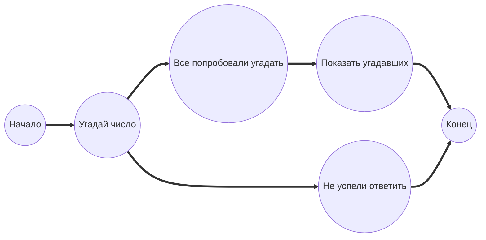
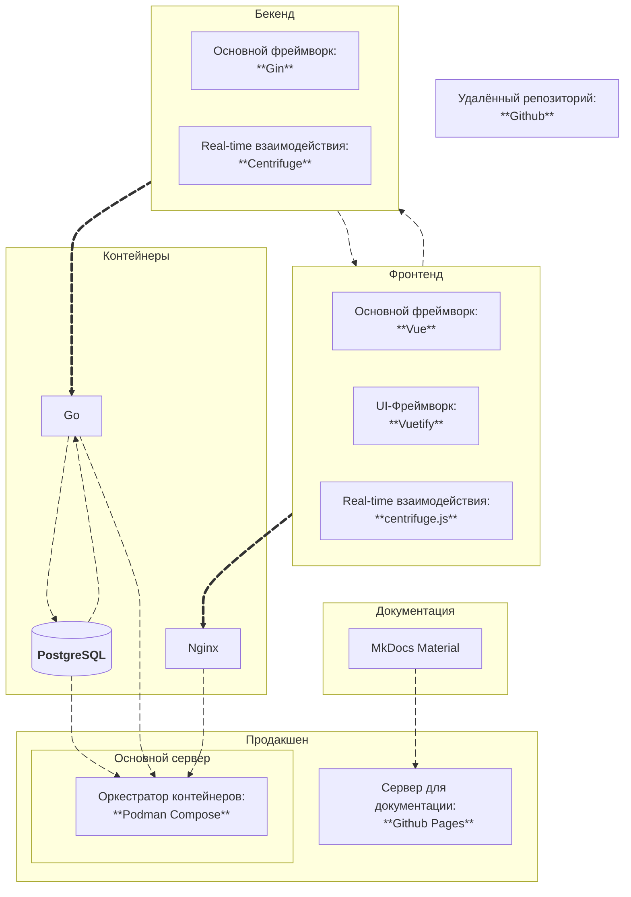

## ==Вступление==
==Ключевая задача==, которую стремиться решить этот проект, звучит так:
    
!!!quote " Задача"
    Как создать модульную и в то же время простую архитектуру для интерактивных онлайн-презентаций, чтобы кто угодно мог легко подстроить проект под себя?

Для её решения проектом предлагается концепт ==PartyFlow==.

## ==PartyFlow==
Сущностью PartyFlow является идея представить каждое сетевое взаимодействие в виде ==узла графа==:


```mermaid
flowchart LR
    id1(("Начало"))

    id2(("Угадай число"))
    id3(("Все попробовали угадать"))
    id4(("Не успели ответить"))


    id5(("Показать угадавших"))
    id6(("Конец"))

    id1 ==> id2
    id2 ==> id3
    id2 ==> id4
    id3 ==> id5
    id5 ==> id6
    id4 ==> id6
```

При этом каждый узел графа ==PartyFlow== принято называть ==PartyQuery==.

## ==PartyQuery==
Узел ==PartyFlow==, содержащий информацию ==об интерфейсе ведущего и участников==, ==условиях перехода== (==MoveConditions==) к другим узлам и ==условиях определения победителей== (==InputCheckers==).

``` go title="Структура PartyQuery"
type PartyQuery struct {
	Name         string // Имя узла
	Input        map[string]any // Интерфейс для участников
	Layout       map[string]any // Интерфейс для ведущего
	Overviewer   map[string]any // Интерфейс отображения победителей
	NextVariants []conditionalMove // Варианты перехода
	Step         int // Счётчик переходов
}
```

``` go title="Пример MoveCondition"
func Timer(data any, args map[string]any) <-chan struct{} {
    channel := make(chan struct{}, 1)
	waitSeconds := time.Duration(data.(int64)) * time.Second
	go func() {
        <-time.After(waitSeconds)
		channel <- struct{}{}
	}()
	return channel
}

// Третьим параметром функции добавления условия можно
// Задать произвольный набор аргументов для MoveCondition (через map)
partyFlow.AddCondition("timer", conditions.Timer, nil) 
```

``` go title="Пример InputChecker"
type Checker struct {
	Pick      func(limits []any) any
	IsCorrect func(input string, correct any) bool
}

func GetTextChecker() Checker {
	return Checker{
		Pick: func(limits []any) any {
			return limits[rand.Intn(len(limits))]
		},

		IsCorrect: func(input string, correct any) bool {
			return input == correct.(string)
		},
	}
}

partyFlow.AddInputChecker("text", input.GetTextChecker())
```

> В итоге требуемая гибкость системы достигается за счёт работы на уровне отдельных ==PartyQuery==, поток которых неявно задаёт декларативно описываемый ==PartyFlow==, расширяемый за счёт ==MoveConditions== и ==InputCheckers==.

## ==Архитектура==
Устройство всей системы на уровне ключевых технологий и программных библиотек приведено на ==диаграмме ниже==:


``` mermaid
---
config:
  flowchart:
    htmlLabels: false
---
flowchart TB
    subgraph Документация
        docs[MkDocs Material]
    end

    repository["Удалённый репозиторий:
    **Github**"]

    subgraph Фронтенд
        frontend-framework["Основной фреймворк:
        **Vue**"]

        interface["UI-Фреймворк:
        **Vuetify**"]

        frontend-realtime["Real-time взаимодействия:
        **centrifuge.js**"]
    end

    subgraph Бекенд
        backend-framework["Основной фреймворк:
        **Gin**"]

        backend-realtime["Real-time взаимодействия:
        **Centrifuge**"]
    end

    subgraph Продакшен
        docs-web["Сервер для документации:
        **Github Pages**"]
        subgraph "Основной сервер"
            container-orchestration["Оркестратор контейнеров:
            **Podman Compose**"]        
        end
    end

    subgraph Контейнеры
        web-server-static[Nginx]
        web-server-dynamic[Go]
        database[("`**PostgreSQL**`")]
    end

    Фронтенд fb@--> Бекенд
    fb@{animation: fast}
    Бекенд  bf@--> Фронтенд
    bf@{animation: fast}

    Фронтенд fw@==> web-server-static
    fw@{animation: slow}

    Бекенд bw@==> web-server-dynamic
    bw@{animation: slow}

    web-server-dynamic wsd@--> database
    wsd@{animation: fast}
    database dws@--> web-server-dynamic
    dws@{animation: fast}

    docs dw@--> docs-web
    dw@{animation: slow}

    database dc@--> container-orchestration
    dc@{animation: slow}
    web-server-dynamic wsc@--> container-orchestration
    wsc@{animation: slow}
    web-server-static wso@--> container-orchestration
    wso@{animation: slow}

    click docs "https://squidfunk.github.io/mkdocs-material/" _blank
    click docs-web "https://docs.github.com/en/pages" _blank
    click container-orchestration "https://podman.io/" _blank
    click backend-framework "https://gin-gonic.com/" _blank
    click frontend-framework "https://vuejs.org/" _blank
    click database "https://www.postgresql.org/" _blank
    click interface "https://vuetifyjs.com/en/" _blank
    click backend-realtime "https://pkg.go.dev/github.com/centrifugal/centrifuge" _blank
    click frontend-realtime "https://github.com/centrifugal/centrifuge-js" _blank
    click web-server-static "https://nginx.org/" _blank
    click web-server-dynamic "https://go.dev/" _blank
    click repository "https://github.com/" _blank
```

!!! note ""
    Нажмите на любой из блоков диаграммы, чтобы перейти к сайту соответствующего проекта
